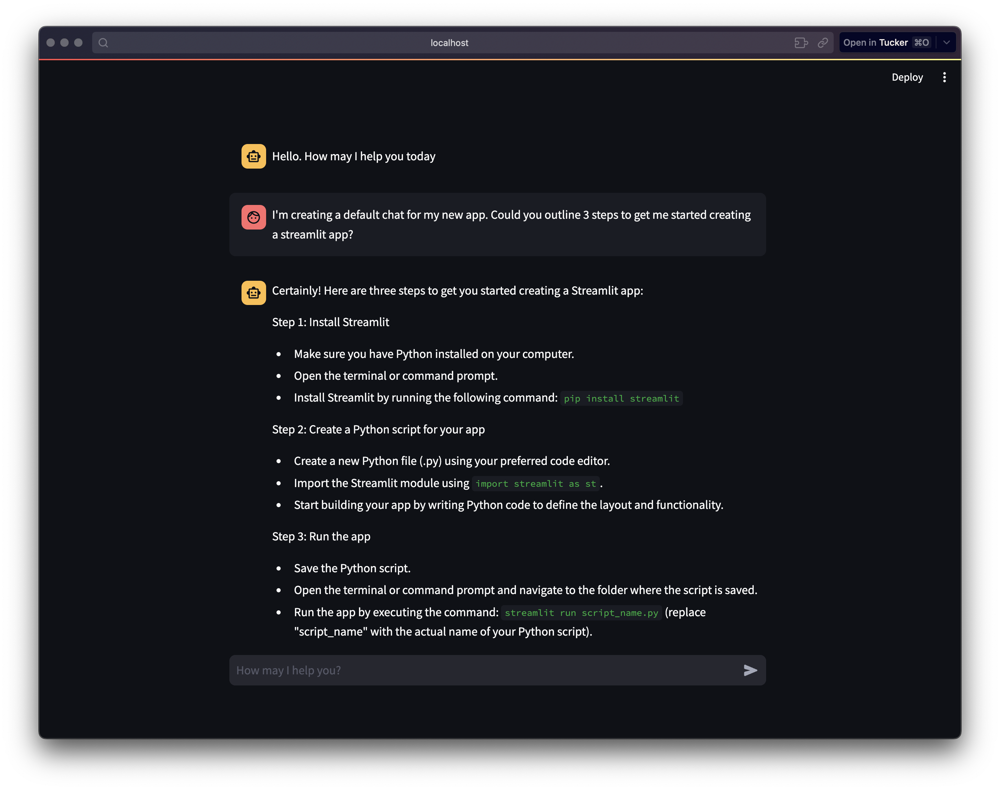

# YaCaCa
### Yet Another Chat Application Chat Archive

YaCaCa is a conversational AI assistant web application powered by OpenAI. It allows users to have natural conversations with an AI agent through a web interface.



## Overview

YaCaCa is designed to provide natural conversational experiences with an AI assistant. Some key benefits and features:

- **Portability** - The self-contained structure makes the app easy to run on any system with Python installed. Users can have consistent experiences across different devices simply by copying their conversation files.

- **Replicable results** - Loading a conversation history loads the same prompts, llm model settings etc — allowing you to reproduce the same conversational flow.

- **Conversation context** - Long conversations are truncated to avoid max token lengths.


## Usage

To start a new conversation, simply run the app:

```
streamlit run main.py
```

### Saving Conversation History

By default, YaCaCa will automatically save conversation histories to `./chats/` with a timestamped filename like `convo_Oct31_5_22_14pm`.

To load a previous conversation:

```
streamlit run main.py -- --load_chat ./chats/convo_Oct31_5_22_14pm
```

### convo_default Template

The `convo_default` file contains starter settings and prompts for the AI assistant and user. It includes:

- `ai_settings` - Settings like model, max tokens, temperature
- `prompts` - Prompts to guide the assistant  
- `conversation` - The conversation log

The template can be customized to load different default settings.

## Implementation

- **Frontend**: Streamlit for the web interface
- **Backend**: OpenAI API for generating responses 

## Installation

### Requirements

- Python 3.6+ 
- Pip package manager
- OpenAI API key

### Setup

1. Clone the repository

```bash
git clone https://github.com/tuckertucker/yacaca.git
```

2. Navigate into the project directory

```bash
cd yacaca
```

3. Install requirements

```bash 
pip install -r requirements.txt
```

4. Save your OpenAI API key in a file named `.OAI_KEY` in the root directory. Make sure to add this file to your `.gitignore` so you don't commit the key.

5. Run the app

```bash
streamlit run main.py
```